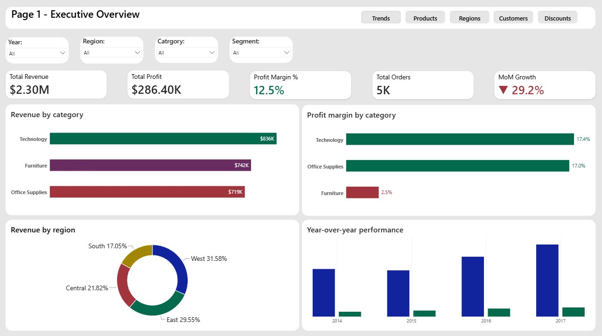
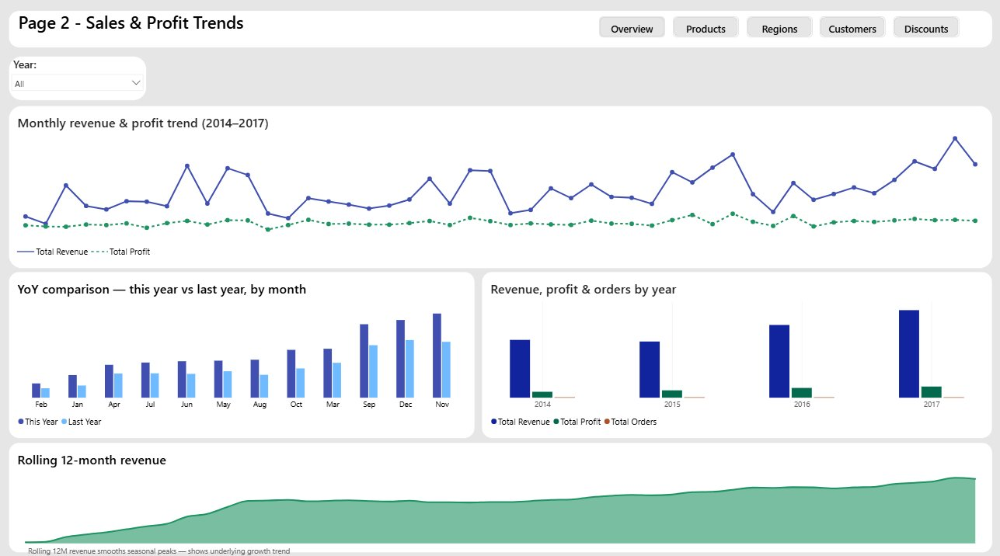
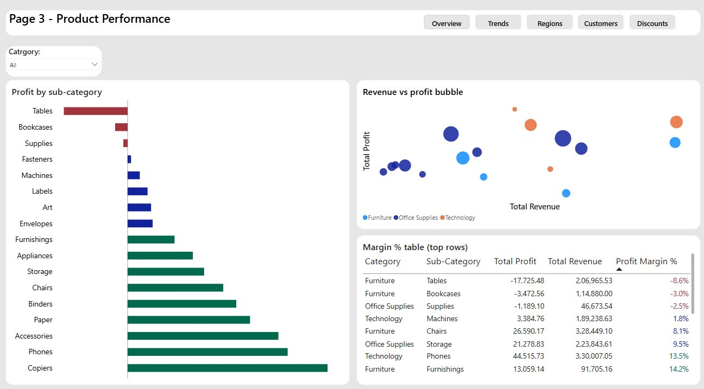
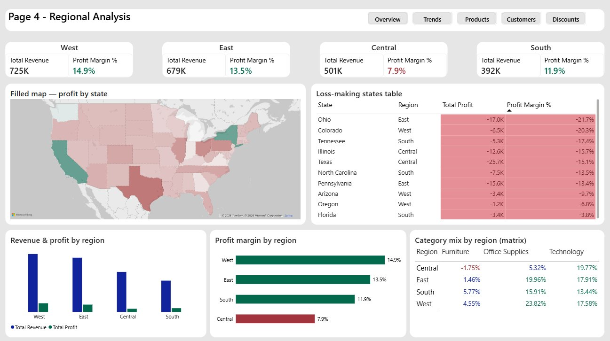
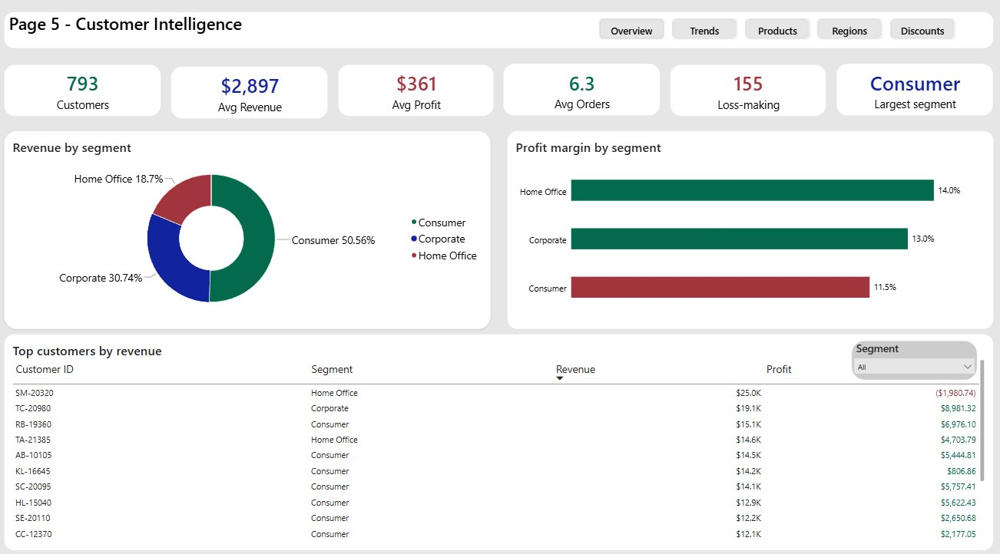
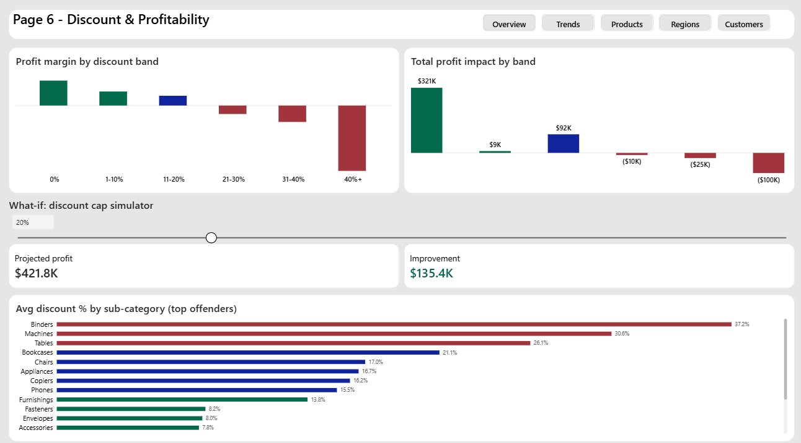

# 📊 Retail Business Intelligence Dashboard — Power BI Project


## 📌 Project Overview

An end-to-end Power BI dashboard analysing **4 years of US retail sales data** (2014–2017)
for the confidential retail client dataset. The dashboard covers revenue performance, product
profitability, regional analysis, customer intelligence, and an interactive discount
impact simulator built using a What-If parameter.

> **Dataset:** Confidential retail client dataset — 9,994 rows · 21 columns · 2014–2017  
> **Tools:** Power BI Desktop · Power Query (M) · DAX  
> **Model:** Star schema — 5 tables (1 fact + 4 dimensions)

---

## 🎯 Business Questions Answered

| # | Business Question | Page |
|---|---|---|
| 1 | What is the overall revenue, profit, and margin performance? | Page 1 |
| 2 | How is the business trending month-over-month and year-over-year? | Page 2 |
| 3 | Which products and sub-categories are profitable vs loss-making? | Page 3 |
| 4 | Which regions and states are underperforming? | Page 4 |
| 5 | Who are the most valuable customers and which segments lead? | Page 5 |
| 6 | How does discounting impact profitability — and what would capping it achieve? | Page 6 |

---

## 📊 Dashboard Pages

### Page 1 — Executive Overview


**Headline KPIs:**

| Metric | Value |
|--------|-------|
| Total Revenue | $2.30M |
| Total Profit | $286.40K |
| Profit Margin % | 12.5% |
| Total Orders | 5,009 |
| MoM Growth (Dec vs Nov 2017) | ▼ 29.2% |

**Revenue & Margin by Category:**

| Category | Revenue | Profit Margin |
|----------|---------|---------------|
| Technology | $836K | 17.4% |
| Furniture | $742K | 2.5% ⚠️ |
| Office Supplies | $719K | 17.0% |

**Revenue by Region:**

| Region | Share |
|--------|-------|
| West | 31.58% |
| East | 29.55% |
| Central | 21.82% |
| South | 17.05% |

**Year-over-Year Revenue:**

| Year | Revenue | Profit | Orders |
|------|---------|--------|--------|
| 2014 | $484K | $49.5K | 969 |
| 2015 | $471K | $61.6K | 1,038 |
| 2016 | $609K | $81.8K | 1,315 |
| 2017 | $733K | $93.4K | 1,687 |

> **Key Insight:** Furniture generates $742K in revenue but only 2.5% profit margin —
> the weakest category by far, primarily driven by loss-making Tables and Bookcases
> sub-categories.

---

### Page 2 — Sales & Profit Trends


**Monthly Revenue & Profit Trend (2014–2017):**
- Revenue shown as solid blue line, Profit as dashed green line
- Clear Q4 seasonal peaks visible every year (November spike)
- December 2017 shows a -29.2% MoM decline after the November peak

**YoY Comparison (This Year vs Last Year by Month):**
- Clustered column chart with This Year (dark blue) vs Last Year (light blue)
- 2017 outperformed 2016 in every month except one

**Rolling 12-Month Revenue:**
- Smooth upward curve confirming consistent underlying growth trend
- Removes seasonal noise from the raw monthly chart

> **Key Insight:** Revenue grew 51.4% from 2014 to 2017. Profit grew 88.6% over
> the same period — margins are improving year on year, meaning the business is
> becoming more efficient, not just larger.

---

### Page 3 — Product Performance


**Profit by Sub-Category (bottom to top — worst first):**

| Sub-Category | Category | Profit | Margin |
|---|---|---|---|
| Tables | Furniture | -$17,725 | -8.6% 🔴 |
| Bookcases | Furniture | -$3,473 | -3.0% 🔴 |
| Supplies | Office Supplies | -$1,189 | -2.5% 🔴 |
| Fasteners | Office Supplies | $950 | 31.4% |
| Machines | Technology | $3,385 | 1.8% |
| Labels | Office Supplies | $5,546 | 44.4% |
| Art | Office Supplies | $6,528 | 24.1% |
| Envelopes | Office Supplies | $6,964 | 42.3% |
| Furnishings | Furniture | $13,059 | 14.2% |
| Appliances | Office Supplies | $18,138 | 16.9% |
| Storage | Office Supplies | $21,279 | 9.5% |
| Chairs | Furniture | $26,590 | 8.1% |
| Binders | Office Supplies | $30,222 | 14.9% |
| Paper | Office Supplies | $34,054 | 43.4% |
| Accessories | Technology | $41,937 | 25.1% |
| Phones | Technology | $44,516 | 13.5% |
| Copiers | Technology | $55,618 | 37.2% |

**Margin % Table (from dashboard — top rows shown):**

| Category | Sub-Category | Total Profit | Total Revenue | Margin |
|---|---|---|---|---|
| Furniture | Tables | -$17,725 | $206,966 | -8.6% 🔴 |
| Furniture | Bookcases | -$3,473 | $114,880 | -3.0% 🔴 |
| Office Supplies | Supplies | -$1,189 | $46,674 | -2.5% 🔴 |
| Technology | Machines | $3,385 | $189,239 | 1.8% 🟡 |
| Furniture | Chairs | $26,590 | $328,449 | 8.1% 🟡 |
| Office Supplies | Storage | $21,279 | $223,844 | 9.5% 🟡 |
| Technology | Phones | $44,516 | $330,007 | 13.5% 🟢 |
| Furniture | Furnishings | $13,059 | $91,705 | 14.2% 🟢 |

> **Key Insight:** Tables and Bookcases are loss-making despite generating $207K
> and $115K in revenue respectively. High average discounting (Tables 26.1%,
> Bookcases 21.1%) is the root cause — directly connected to the findings on Page 6.

---

### Page 4 — Regional Analysis


**Region Summary Cards:**

| Region | Total Revenue | Profit Margin |
|--------|---------------|---------------|
| West | $725K | 14.9% ✅ |
| East | $679K | 13.5% ✅ |
| Central | $501K | 7.9% ⚠️ |
| South | $392K | 11.9% ✅ |

**Filled Map:** US state-level profit shown with diverging color scale
(Red = loss-making, White = break-even, Green = profitable)

**Loss-Making States (10 states with negative total profit):**

| State | Region | Total Profit | Margin |
|-------|--------|--------------|--------|
| Texas | Central | -$25.7K | -15.1% |
| Ohio | East | -$17.0K | -21.7% |
| Pennsylvania | East | -$15.6K | -13.4% |
| Illinois | Central | -$12.6K | -15.7% |
| North Carolina | South | -$7.5K | -13.5% |
| Colorado | West | -$6.5K | -20.3% |
| Tennessee | South | -$5.3K | -17.4% |
| Arizona | West | -$3.4K | -9.7% |
| Florida | South | -$3.4K | -3.8% |
| Oregon | West | -$1.2K | -6.8% |

**Category Mix by Region — Profit Margin % (matrix):**

| Region | Furniture | Office Supplies | Technology |
|--------|-----------|-----------------|------------|
| Central | -1.75% 🔴 | 5.32% | 19.77% |
| East | 1.46% | 19.96% | 17.91% |
| South | 5.77% | 15.91% | 13.44% |
| West | 4.55% | 23.82% | 17.58% |

> **Key Insight:** Central region's 7.9% margin is the weakest of all four regions.
> Central/Furniture at -1.75% is the single worst-performing region-category
> combination — the only cell in the matrix with a negative margin. Texas alone
> accounts for -$25.7K in losses, the highest of any state.

---

### Page 5 — Customer Intelligence


**Customer Summary Cards:**

| Metric | Value |
|--------|-------|
| Total Customers | 793 |
| Avg Revenue per Customer | $2,897 |
| Avg Profit per Customer | $361 |
| Avg Orders per Customer | 6.3 |
| Loss-Making Customers | 155 (19.5%) |
| Largest Segment | Consumer |

**Revenue by Segment:**

| Segment | Revenue | Share | Customers |
|---------|---------|-------|-----------|
| Consumer | $1.16M | 50.56% | 409 |
| Corporate | $706K | 30.74% | 236 |
| Home Office | $430K | 18.70% | 148 |

**Profit Margin by Segment:**

| Segment | Margin |
|---------|--------|
| Home Office | 14.0% ✅ |
| Corporate | 13.0% ✅ |
| Consumer | 11.5% 🟡 |

**Top 10 Customers by Revenue:**

| Customer ID | Segment | Revenue | Profit |
|---|---|---|---|
| SM-20320 | Home Office | $25.0K | -$1,980 🔴 |
| TC-20980 | Corporate | $19.1K | $8,981 |
| RB-19360 | Consumer | $15.1K | $6,976 |
| TA-21385 | Home Office | $14.6K | $4,704 |
| AB-10105 | Consumer | $14.5K | $5,445 |
| KL-16645 | Consumer | $14.2K | $807 |
| SC-20095 | Consumer | $14.1K | $5,757 |
| HL-15040 | Consumer | $12.9K | $5,622 |
| SE-20110 | Consumer | $12.2K | $2,651 |
| CC-12370 | Consumer | $12.1K | $2,177 |

> **Key Insight:** SM-20320 is the top customer by revenue ($25K) but is
> actually loss-making at -$1,980 profit — a critical finding proving that
> revenue alone is not a reliable measure of customer value. Home Office is
> the smallest segment but has the highest profit margin (14.0%).

---

### Page 6 — Discount & Profitability


**Profit Margin by Discount Band:**

| Discount Band | Order Lines | Total Profit | Margin |
|---|---|---|---|
| 0% (No discount) | 4,798 | $321K | 29.5% ✅ |
| 1-10% | 94 | $9K | 16.6% ✅ |
| 11-20% | 3,709 | $92K | 11.6% 🟡 |
| 21-30% | 227 | -$10K | -10.0% 🔴 |
| 31-40% | 233 | -$25K | -19.4% 🔴 |
| 40%+ | 933 | -$100K | -77.4% 🔴 |

**What-If Discount Cap Simulator (at 20% cap):**

| Metric | Value |
|--------|-------|
| Projected Profit | $421.8K |
| Improvement vs Actual | +$135.4K |
| Improvement % | +47.3% |

**Avg Discount % by Sub-Category (Top Offenders):**

| Sub-Category | Avg Discount |
|---|---|
| Binders | 37.2% 🔴 |
| Machines | 30.6% 🔴 |
| Tables | 26.1% 🔴 |
| Bookcases | 21.1% 🔴 |
| Chairs | 17.0% 🟡 |
| Appliances | 16.7% 🟡 |
| Copiers | 16.2% 🟡 |
| Phones | 15.5% 🟡 |
| Furnishings | 13.8% 🟢 |
| Fasteners | 8.2% 🟢 |
| Envelopes | 8.0% 🟢 |
| Accessories | 7.8% 🟢 |

> **Key Insight:** Orders with discounts above 20% consistently generate negative
> profit margins. The 933 orders in the 40%+ discount band alone destroy $99.6K
> in profit. Capping all discounts at 20% would improve total profit by $135.4K
> — a 47.3% improvement — without changing any list prices.

---

## 🏗️ Data Model (Star Schema)

Built entirely in Power Query by duplicating the source CSV once and creating
dimension tables from it — no external tools required.

```
                    ┌──────────────┐
                    │  Dim_Date    │
                    │  1,461 rows  │
                    └──────┬───────┘
                           │ 1
                    ┌──────┴───────────────────────────┐
┌─────────────────┐ │         Fact_Retail           │ ┌─────────────────┐
│  Dim_Customer   │─│         9,994 rows                │─│  Dim_Product    │
│  793 rows       │ │  Sales · Profit · Discount        │ │  1,862 rows     │
└─────────────────┘ │  Quantity · ShipDays · GeoKey     │ └─────────────────┘
                    └──────────────┬───────────────────┘
                                   │
                    ┌──────────────┴──────┐
                    │   Dim_Geography     │
                    │   604 rows          │
                    └─────────────────────┘
```

**All relationships:** One-to-Many (Dimension → Fact) · Single filter direction

| Relationship | From | To |
|---|---|---|
| Date | Dim_Date[Date] | Fact_Retail[OrderDate] |
| Customer | Dim_Customer[CustomerID] | Fact_Retail[CustomerID] |
| Product | Dim_Product[ProductID] | Fact_Retail[ProductID] |
| Geography | Dim_Geography[GeoKey] | Fact_Retail[GeoKey] |

---

## 🧠 DAX Measures (25+)

| Group | Measure | Purpose |
|-------|---------|---------|
| **Core** | Total Revenue | SUM of Sales |
| **Core** | Total Profit | SUM of Profit |
| **Core** | Total Orders | DISTINCTCOUNT of OrderID |
| **Core** | Profit Margin % | Profit / Revenue |
| **Core** | Avg Order Value | Revenue / Orders |
| **Core** | Total Customers | DISTINCTCOUNT of CustomerID |
| **Core** | Loss Making Customers | Customers with negative total profit |
| **Time** | Revenue YTD | Year-to-date revenue |
| **Time** | Revenue MTD | Month-to-date revenue |
| **Time** | Revenue Full Month | Full month total (used for MoM) |
| **Time** | Revenue LY | Same period last year |
| **Time** | Revenue PM | Prior month |
| **Time** | Revenue Rolling 12M | Trailing 12-month revenue |
| **Growth** | YoY Growth % | Year-over-year % change |
| **Growth** | MoM Growth % | Month-over-month % change |
| **Growth** | MoM Growth Label | Arrow + % formatted label card |
| **Customer** | Avg Revenue per Customer | Revenue / Customers |
| **Customer** | Avg Profit per Customer | Profit / Customers |
| **Customer** | Avg Orders per Customer | Orders / Customers |
| **Ranking** | Product Revenue Rank | RANKX across all products |
| **Ranking** | Sub-Category Profit Rank | RANKX across sub-categories |
| **Dynamic** | Margin Band | SWITCH — Loss / Low / Medium / High |
| **Dynamic** | Selected Category Title | SELECTEDVALUE for dynamic titles |
| **What-If** | Profit Above Cap | Profit with discount cap applied |
| **What-If** | Projected Profit Improvement | Gain from enforcing discount cap |

---

## 💡 Key Findings Summary

| # | Finding | Business Impact |
|---|---------|-----------------|
| 1 | **Discounting above 20% destroys profit** | 1,393 orders at 20%+ discount = -$135K in losses |
| 2 | **Tables sub-category loses money** | -$17,725 total profit on $207K revenue (-8.6% margin) |
| 3 | **Central region is the weakest market** | 7.9% margin vs 12.5% company average |
| 4 | **19.5% of customers are loss-making** | 155 of 793 customers generate negative profit |
| 5 | **Top revenue customer loses money** | SM-20320: $25K revenue but -$1,980 profit |
| 6 | **Revenue grew 51.4% (2014–2017)** | Profit grew 88.6% — efficiency improving |
| 7 | **Capping discounts at 20%** | Projects +$135.4K profit improvement (+47.3%) |

---

## 🔧 Setup Instructions

### Dataset
```
Internal: https://www.client.com/datasets/vivek468/Retail-dataset-final
File: SampleRetail.csv
Rows: 9,994 | Columns: 21 | Period: 2014–2017
```

### To rebuild this project
1. Download Power BI Desktop (free): https://powerbi.microsoft.com/desktop
2. Download the dataset from Internal
3. Follow `pbix-guide/01_data_model.md` → build the star schema in Power Query
4. Add DAX measures from `dax/all_measures.dax`
5. Build each page following `pbix-guide/04_page_by_page.md`

---

## 📂 Project Structure

```
Retail-powerbi/
│
├── README.md                          ← This file
│
├── dax/
│   └── all_measures.dax               ← All 25+ DAX measures with comments
│
├── pbix-guide/
│   ├── 01_data_model.md               ← Star schema build guide
│   ├── 02_power_query.md              ← Power Query M transformations
│   └── 04_page_by_page.md             ← Page-by-page build instructions
│
├── docs/
│   ├── data_dictionary.md             ← Column definitions and business rules
│   └── findings_and_dax_reference.md  ← Key findings and DAX cheatsheet
│
└── screenshots/
    ├── page1_executive_overview.png
    ├── page2_sales_trends.png
    ├── page3_product_performance.png
    ├── page4_regional_analysis.png
    ├── page5_customer_intelligence.png
    └── page6_discount_profitability.png
```

---

*Built by: [Your Name] · Power BI Desktop · Confidential retail client dataset · 2024*
